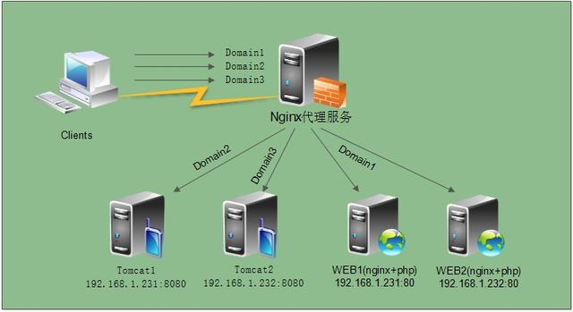

#### 什麼是Nginx? 
##### HTTP伺服器
作為HTTP伺服器，可以極快的速度為伺服器上的靜態文件（ex:HTML、圖片）通過HTTP協議展現給客戶端

##### 反向代理伺服器
客戶端本來可以直接通過HTTP訪問某網站的應用伺服器，如果管理員在中間加上一個Nginx，客戶端會先請求Nginx，Nginx再請求應用伺服器，並將結果返回給客戶端，此時Nginx就是反向代理伺服器。

##### 負載均衡器
當網站訪問量變大，網站越來越慢，一台伺服器已經不夠用。可將相同的應用部署在多台伺服器上，將大量用戶的請求分配給多台機器處理。同時帶來的好處是，其中一台伺服器掛了，只要還有其他伺服器正常運行，就不會影響用戶使用。
