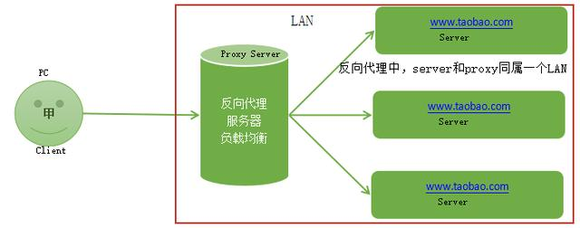
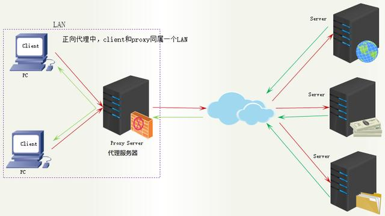
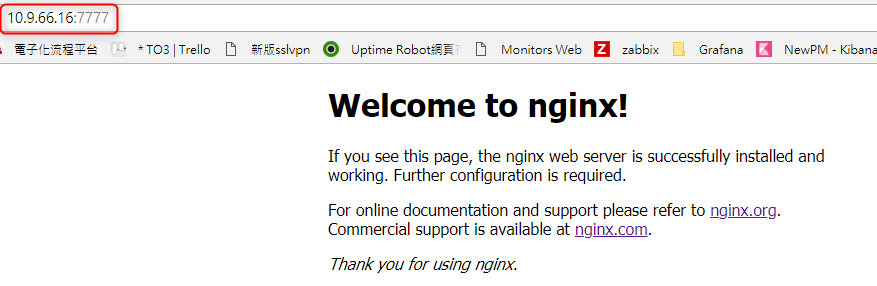
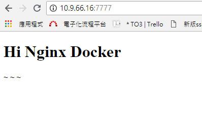
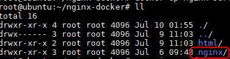
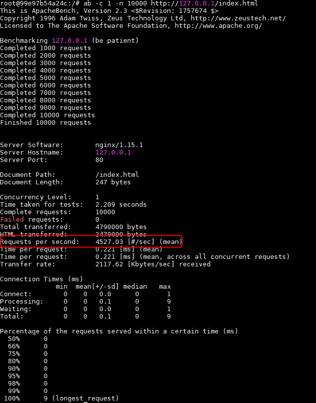
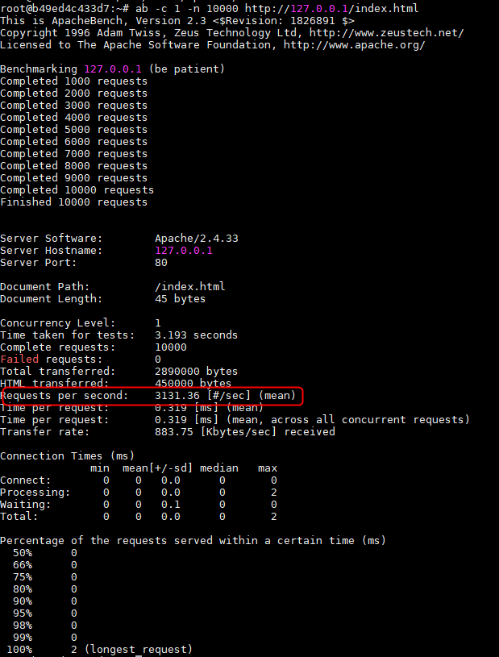
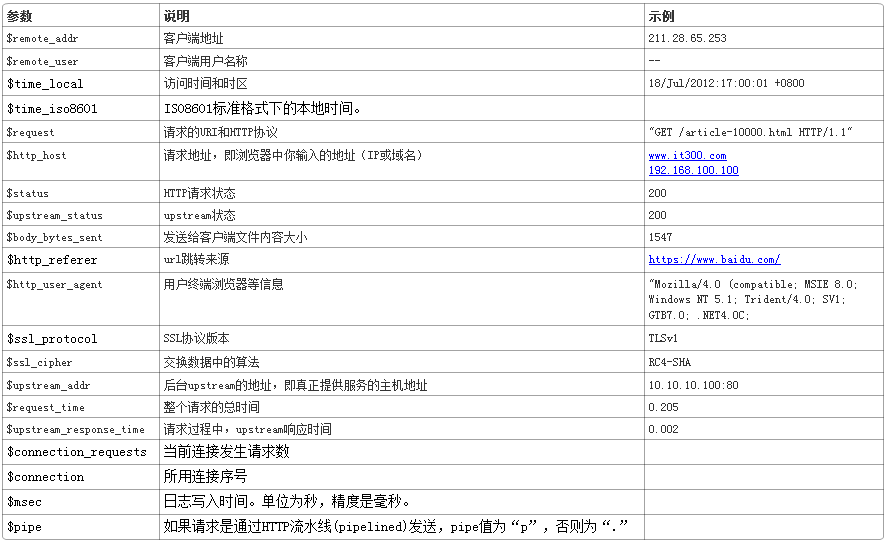
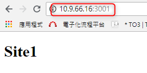

#### 什麼是Nginx?   
Nginx為一個網頁伺服器，它能反向代理 HTTP, HTTPS, SMTP, POP3, IMAP的協定連接，以及設置Load balance和HTTP cache。
##### HTTP伺服器
作為HTTP伺服器，可以極快的速度為伺服器上的靜態文件（ex:HTML、圖片）通過HTTP協議展現給客戶端。

##### 反向代理伺服器
客戶端本來可以直接通過HTTP訪問某網站的應用伺服器，如果管理員在中間加上一個Nginx，客戶端會先請求Nginx，Nginx再請求應用伺服器，並將結果返回給客戶端，此時Nginx就是反向代理伺服器。

##### 負載均衡器
當網站訪問量變大，網站越來越慢，一台伺服器已經不夠用。可將相同的應用部署在多台伺服器上，將大量用戶的請求分配給多台機器處理。同時帶來的好處是，其中一台伺服器掛了，只要還有其他伺服器正常運行，就不會影響用戶使用。

#### 安裝Nginx

   使用docker安裝
       
       docker run -d -p 7777:80 --name nginx-server nginx
查看容器是否運行
    
       docker ps -a

安裝完成畫面

#### 映射網頁目錄 
因為網頁文件都放在容器裡，無法直接修改，顯然很不方便，
因此可將網頁文件所在的目錄/usr/share/nginx/html映射到本機

首先，新建一個目錄，並進入該目錄
 
       mkdir nginx-docker
       cd nginx-docker
在該目錄底下新建一個html子目錄
      
       mkdir html

並在此目錄底下建置一個index.html文件，內容如下:

    <!DOCTYPE html>
    <html lang="en">
        <head>
        <title></title>
        <meta charset="UTF-8">
        <meta name="viewport" content="width=device-width, initial-scale=1">
        </head>
        <body>
            <h1>Hi Nginx Docker</h1>
        </body>
    </html>

將原本的容器停止並刪除後，到剛剛建置的資料夾底下
        
        cd nginx-docker
接著，就可以把子目錄html，映射到容器的網頁文件目錄/usr/share/nginx/html裡了
        
        docker run -d -p 7777:80 --name nginx-server -v "$PWD/html":/usr/share/nginx/html nginx
打開瀏覽器，就可以看到我們輸入的內容了

#### 修改Nginx的設定檔
因為還要修改Nginx容器內的設定檔，可以將容器內的Nginx設定檔拷貝到本機以方便作業，
以下指令為將nginx-server容器的(自行命名的容器名稱)/etc/nginx拷貝到當前目錄，最後面的點不能省略

        docker cp nginx-server:/etc/nginx .
執行完成後，會看到當前目錄底下多出一個nginx子目錄

名稱改為conf以利日後辨識

        mv nginx conf

再來將前一個建置的容器停止運行並刪除，重新運行一個新的容器，這次不只映射了網頁目錄，還映射了設定檔

        docker run -d -p 7777:80 --name nginx-server -v "$PWD/html":/usr/share/nginx/html -v "$PWD/conf":/etc/nginx nginx

#### 簡單壓力測試
測試Nginx的性能(因我們安裝的Nginx服務為容器，以下命令要在Nginx容器使用)

1.安裝ab命令
       
       apt-get install apache2-utils

2.對Nginx預設主頁進行10000次的連接測試

       ab -c 1 -n 10000 http://127.0.0.1/index.html

3.可看到平均每秒處理4000多筆請求

#### 補充:與Apache的性能比較

1.Docker安装Apache

       docker run -p 3003:80 -d --name apache httpd

2.對Apache預設主頁進行10000次的連接測試

       ab -c 1 -n 10000 http://127.0.0.1/index.html

3.Apache平均每秒處理3000多筆請求

#### 設定檔介紹
安裝完Nginx後，原本的設定預設就已經配置妥當，所以能夠直接啟用服務，不過我們還是要了解Nginx是如何配置的

在Nginx的設定檔中，分為:指令、模組兩種內容，指令需要填入對應的參數及空格，最後面需以分號 ; 做結尾，模組的部份則是以大括號{ }做區分，我們可以在{ }內部新增所需的指令與模組，進而擴充功能，Nginx程式註解的部分則使用 # 符號

基本的Nginx設定檔模組包含http、server、location三個模組

主要設定檔在 nginx.conf
    
    # 啟用程序的Linux帳戶
    user  nginx;

    # 啟用的執行緒數量(建議CPU核心數 x 2)
    worker_processes  2;
    
    # Error Log檔的位置
    error_log  /var/log/nginx/error.log warn;
    #log等級從低到高依序為 debug | info | notice | warn | error | crit
    
    #紀錄pid的文件
    pid        /var/run/nginx.pid;

    events {
        # 允許同一時間連線總數量
        worker_connections  1024;
    }

    http {
        include       /etc/nginx/mime.types;
        default_type  application/octet-stream;
        
        # 設定log記錄格式
        # 語法:log_format name（格式名字） 格式樣式（想要得到什麼樣的log內容）
        log_format  main  '$remote_addr - $remote_user   [$time_local] "$request" '
                      '$status $body_bytes_sent "$http_referer" '
                      '"$http_user_agent" "$http_x_forwarded_for"';

可設置的參數格式及說明如下：

        
        # 設定log檔的存放路徑
        access_log  /var/log/nginx/access.log  main;

        #sendfile設定可提高Nginx靜態資源託管效率，它是一個系統調用，直接在內核空間完成文件發送，不需要先read再write
        sendfile        on;
        #只有在啟用sendfile之後才生效。啟用之後，封包會累計到一定大小之後才會發送，減小額外發送，提高網路效率。
        #tcp_nopush     on;

        keepalive_timeout  65;
        
        # 預設不會自動啟動gzip壓縮
        #gzip  on;
        
        # 載入/etc/nginx/conf.d/下的所有設定檔
        # 通常都是各個虛擬主機的配置
        include /etc/nginx/conf.d/*.conf;
    }

預設主機的設定 default.conf

    server {
        # 虛擬主機的Port和名稱
        listen       80;
        server_name  localhost;
        
        # 預設編碼，通常不建議開啟，讓網頁中的meta或header自行定義
        #charset koi8-r;

        # 可額外針對這個站台修改log的存放位置
        #access_log  /var/log/nginx/host.access.log  main;
        
        # 根目錄的設定
        location / {

            # 實際檔案位置
            root   /usr/share/nginx/html;
            # 預設首頁檔名
            index  index.html index.htm;
        }
        
        # 如果發生404可以指定到特定的頁面來顯示
        #error_page  404              /404.html;

        # redirect server error pages to the static page /50x.html
        #
        error_page   500 502 503 504  /50x.html;
        location = /50x.html {
            root   /usr/share/nginx/html;
        }

        # proxy the PHP scripts to Apache listening on 127.0.0.1:80
        #
        #location ~ \.php$ {
        #    proxy_pass   http://127.0.0.1;
        #}

        # pass the PHP scripts to FastCGI server listening on 127.0.0.1:9000
        #
        #location ~ \.php$ {
        #    root           html;
        #    fastcgi_pass   127.0.0.1:9000;
        #    fastcgi_index  index.php;
        #    fastcgi_param  SCRIPT_FILENAME  /scripts$fastcgi_script_name;
        #    include        fastcgi_params;
        #}

        # deny access to .htaccess files, if Apache's document root
        # concurs with nginx's one
        #
        #location ~ /\.ht {
        #    deny  all;
        #}
    }
#### Nginx建置多台虛擬主機
虛擬主機（Virtual Host）用的是特殊的軟硬件技術，可以在一台Nginx主機上綁定多個網域，架設多個不同的網站，每台虛擬主機都可以是一個獨立的網站，具有獨立的域名及完整的Internet服務功能，利用虛擬主機，不需為每個要運行的網站提供一台獨立的Nginx伺服器。

##### 虛擬主機配置
到 /nginx-docker/conf/conf.d (本機映射到容器的路徑) 目錄底下新增 site1.conf 和 site2.conf 文件

##### site1.conf
    
    server {
    listen       81;
    server_name  localhost;

    #charset koi8-r;
    #access_log  /var/log/nginx/host.access.log  main;

    location / {
        root   /etc/nginx/data/site1;
        index  index.html index.htm;
    }
    }                ......(以下省略)

##### site2.conf
    
    server {
    listen       82;
    server_name  localhost;

    #charset koi8-r;
    #access_log  /var/log/nginx/host.access.log  main;

    location / {
        root   /etc/nginx/data/site2;
        index  index.html index.htm;
    }
    }                ......(以下省略)

到 nginx-docker/conf/ (本機映射到容器裡的/etc/nginx/路徑)目錄底下新增 data 子目錄，在 /data/ 下分別建置site1和site2的文件夾，最後分別在文件夾裡建置 index.html 

因為有修改到設定檔，需重新運行容器才會生效，因此我們要將原本的容器停止運行並刪除，重新再建一個容器

切換到/nginx-docker/下。執行以下命令:

    docker run -d -p 7777:80 -p 3001:81 -p 3002:82 --name nginx-server -v "$PWD/html":/usr/share/nginx/html -v "$PWD/conf":/etc/nginx nginx

* 因新增2台虛擬主機設定的port為81、82，這裡需特別注意要新增指定本機與容器對應的port

#### 測試
查看容器是否運行成功

     docker ps -a

我們也可以進入容器查看指定的本機目錄是否有映射到容器裡

     docker exec -ti 容器名稱 bash

最後，到瀏覽器輸入http://10.9.66.16:3001 及 http://10.9.66.16:3002 查看site1和site2下的兩個index.html是否正常顯示

